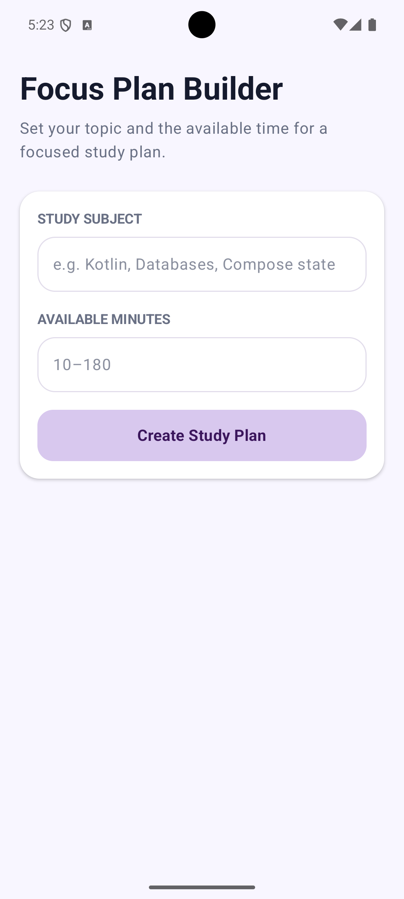
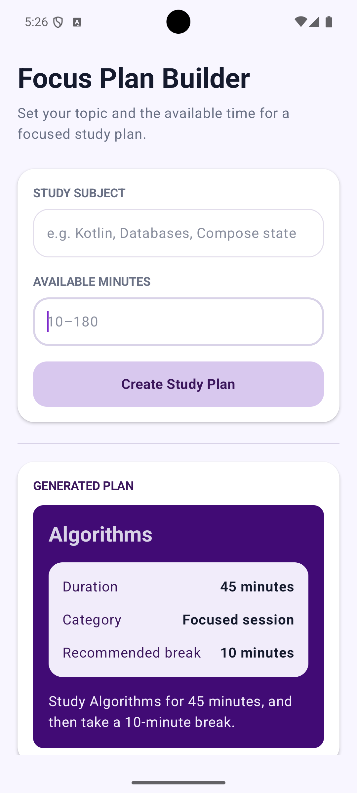

# Focus Plan Builder

## Name
Nandana Shashi

## Assignment
A Jetpack Compose Android app. 

## Description

Focus Plan Builder is a Jetpack Compose Android application that helps students create a focused study plan based on a subject and the amount of available study time.

The user enters a study subject and a duration between 10 and 180 minutes. The application validates the input and generates a study plan containing the duration category, recommended break time, and a summary sentence.

## How to Run

1. Open the project in Android Studio.
2. Allow Gradle to sync and finish indexing.
3. Select an Android emulator or connected Android device.
4. Click the Run button in Android Studio.
5. Enter a study subject and a duration between 10 and 180 minutes.
6. Click **Create Study Plan**.

## Screenshot

**Initial state** 

Before any input is entered:

**After generating a plan** 

Subject and duration filled in, plan displayed:

## State and Recomposition

State lives in `FocusPlanRoute`, which owns the subject, the available minutes, and the generated plan. The subject and minutes use `rememberSaveable`, so they survive rotation. The plan itself uses plain `remember`, so it resets on rotation.

`FocusPlanScreen` is presentational: it takes state and callbacks from the route and renders the UI. Two behaviors worth knowing:

- **Editing an input clears the plan.** Changing the subject or minutes after a plan's been generated clears it, so the app never shows a stale plan.
- **A valid plan triggers recomposition.** Once generated, Compose redraws the screen with the result.

**Which composable owns the application state?**
`FocusPlanRoute` owns all state { `subject`, `minutesText`, and `plan` } and passes it down to `FocusPlanScreen` along with callbacks, keeping `FocusPlanScreen` fully presentational.

**Why are the text-field values stored as String rather than Int?**
`OutlinedTextField` requires a `String` value, and storing raw user input as a string allows intermediate states, like an empty field or a partially typed number that wouldn't be valid as an `Int`.

**Why is `toIntOrNull()` safer than `toInt()` for this application?**
`toInt()` throws an exception on invalid input (empty string, non-numeric text), which would crash the app while the user is still typing. `toIntOrNull()` returns `null` instead, letting the app treat incomplete input as "not ready yet" rather than an error.

**What state change causes the button to be recomposed?**
The button depends on `canCreatePlan`, which gets recalculated every time `subject` or `minutesText` changes. So typing in either field triggers recomposition, and the button's enabled/disabled state and color update based on whether the current input is valid.

**What does `rememberSaveable` preserve that a local variable would not?**
If the screen rotates, the whole activity gets recreated, and a normal variable (or even `remember`) would just reset back to its default. `rememberSaveable` saves the value into the saved-instance-state bundle first, so `subject` and `minutesText` come back with whatever the user had typed instead of clearing out.

## Generative-AI Assistance

I used Claude while working on this assignment to help me understand some of the Kotlin syntax and Compose concepts I was less familiar with, debug a few errors I ran into, and clarify what the assignment's questions were actually asking.

